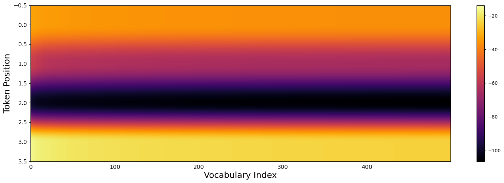

# Feature Analysis

This tutorial covers how to analyze and visualize the features learned by your sparse autoencoder. Understanding what features represent is crucial for mechanistic interpretability.

## Overview

DeepLens provides several utilities for feature analysis:

| Function | Description |
|----------|-------------|
| `generate_feature_heatmap` | Visualize logit distributions across positions |
| `plot_topk_distribution` | Bar chart of top-k token predictions |
| `get_top_k_tokens` | Extract top predicted tokens at each position |

---

## Basic Analysis Workflow

After training an SAE, the typical analysis workflow is:

1. Extract activations from a sample text
2. Encode through the SAE to get feature activations
3. Identify which features are active
4. Investigate what those features represent

```python
from deeplens.extractor import ExtractSingleSample
from deeplens.intervene import InterveneFeatures

# Extract activations
extractor = ExtractSingleSample(hf_model="gpt2", layer=3)
text = "The capital of France is Paris."
activations = extractor.get_mlp_acts(text)

# Load SAE and get feature activations
intervene = InterveneFeatures(
    sae_model="models/best_model.pt",
    sae_config="config.yaml"
)

# Find active features at last token
active_features = intervene.get_alive_features(activations, token_position=-1)
print(f"Active features: {active_features[:10]}")
```

---

## Finding Active Features

### Get All Non-Zero Features

```python
# Get indices of all active features at the last token
active_features = intervene.get_alive_features(
    activations,
    token_position=-1  # -1 for last token
)

print(f"Number of active features: {len(active_features)}")
print(f"Feature indices: {active_features.tolist()}")
```

### Get Top-K Most Active Features

```python
# Get only the top 20 most active features
top_features = intervene.get_alive_features(
    activations,
    token_position=-1,
    k=20  # Only return top 20
)

print(f"Top 20 features: {top_features.tolist()}")
```

---

## Visualizing Logits

### Heatmap

Generate a heatmap showing how logits distribute across the vocabulary:

```python
from deeplens.utils.analysis import generate_feature_heatmap
from deeplens.intervene import ReinjectSingleSample

# Get logits from the model
reinject = ReinjectSingleSample(hf_model="gpt2")

# First, get modified activations (or original ones)
_, original_acts, modified_acts = intervene.intervene_feature(
    activations=activations,
    feature=active_features[0].item(),
    alpha=1.0  # No modification, just decode
)

# Get logits
logits = reinject.reinject_and_generate(
    text=text,
    modified_activations=original_acts,
    layer=3,
    generate=False
)

# Generate heatmap
generate_feature_heatmap(logits, save_name="logits_heatmap")
```

The heatmap shows:
- **X-axis**: Vocabulary indices
- **Y-axis**: Token positions
- **Color**: Logit magnitude (brighter = higher)



### Top-K Token Distribution

Visualize the most likely next tokens at a specific position:

```python
from deeplens.utils.analysis import plot_topk_distribution

# Plot top 20 predictions at the last position
plot_topk_distribution(
    logits,
    k=20,
    tokenizer="gpt2",
    position=-1,  # Last position
    use_softmax=True,
    title="Top-20 Next Token Predictions",
    save_name="token_distribution"
)
```

Parameters:
- `k`: Number of top tokens to show
- `position`: Which token position to analyze (use -1 for last)
- `use_softmax`: Convert logits to probabilities
- `title`: Plot title
- `save_name`: Filename to save (without extension)


### Extract Top Tokens as Data

```python
import pandas as pd

# Get as pandas DataFrame for easier analysis
df = get_top_k_tokens(
    logits,
    k=10,
    tokenizer="gpt2",
    to_dataframe=True
)

print(df.head(20))
```

---

## Troubleshooting

### Empty Active Features

If `get_alive_features` returns an empty tensor:
- Check that your SAE is trained properly
- Try a different token position
- Verify activations are not all zeros
